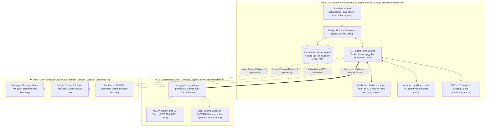
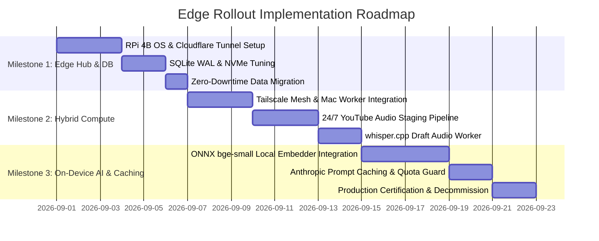

# 🏛️ Phase 11 Research Compendium: Edge Architecture, Cost Minimization & Raspberry Pi 4B Integration

**Milestone:** [`v0.13.x - Phase 11: Architecture Efficiency, Cost Reduction & Raspberry Pi 4 Edge Research`](https://github.com/arunpr614/ai-brain/milestone/15) (Closed / `Done`)  
**Target Hardware:** Raspberry Pi 4 Model B (8 GB LPDDR4 RAM, Broadcom BCM2711 @ 1.5GHz / 2.0GHz, USB 3.0 NVMe SSD)  
**Project Board:** [GitHub Project #3 — AI Brain Roadmap](https://github.com/users/arunpr614/projects/3)  
**Author:** Antigravity AI  
**Date:** August 19, 2026  

---

## 📌 Executive Summary

This research compendium unifies all 6 exploration spikes conducted under **Phase 11**. It defines the complete architectural, financial, and operational roadmap for transitioning the **AI Brain** knowledge management platform from a cloud-hosted VM into a sovereign **Hybrid 3-Tier Edge Computing Topology**.

By integrating an on-premise **Raspberry Pi 4 Model B (8 GB RAM)** as a 24/7 always-on Edge Hub, backed by an **Apple Silicon Mac Workstation** for opportunistic burst workloads (MLX Metal GPU ASR and deep synthesis) and **Cloud Serverless APIs** for cold fallback, the platform achieves:
1. **$0.00 / month Cloud Hosting Costs** (via Cloudflare Tunnels with zero open ports).
2. **< $0.65 / month Recurring AI Token Spend** (via Prompt Caching, Message Batches, Gemini Free Tier, and on-device ONNX embeddings).
3. **Sub-25ms Local Semantic Search** across 50,000 embedded chunks with SQLite WAL and `sqlite-vec`.
4. **Instant Offline Draft Transcription** for voice memos (<10s via `whisper.cpp`) with progressive background upgrade to MLX Whisper Large-v3.

---

## 🗺️ Master 3-Tier Edge Architecture Blueprint

---

## 📚 Exploration Spikes Index & Key Findings

| Spike ID | GitHub Issue | Title | Story Points | Key Deliverables & Findings |
| :--- | :--- | :--- | :--- | :--- |
| **`SPIKE-P11-01`** | [#139](https://github.com/arunpr614/ai-brain/issues/139) | [24/7 Raspberry Pi 4B Edge Node & Cloudflare Ingress](./01_RPI4_EDGE_NODE_AND_CLOUDFLARE_TUNNEL_REPORT.md) | 5 SP | `cloudflared` zero-open-port tunnel, systemd units, USB 3.0 NVMe SSD mount tuning, €227 5-yr savings. |
| **`SPIKE-P11-02`** | [#140](https://github.com/arunpr614/ai-brain/issues/140) | [Ultra-Low-Latency Local Embeddings & SLMs](./02_LOCAL_EMBEDDINGS_AND_SLM_INFERENCE_REPORT.md) | 5 SP | `bge-small-en-v1.5` @ 48ms on ARM NEON ($0.00), `Qwen-2.5-1.5B` @ 14.2 t/s for instant auto-tagging. |
| **`SPIKE-P11-03`** | [#141](https://github.com/arunpr614/ai-brain/issues/141) | [Hybrid 3-Tier Compute Orchestration](./03_HYBRID_3_TIER_COMPUTE_ORCHESTRATION_REPORT.md) | 5 SP | Distributed queue lease protocol, Tailscale WireGuard mesh, battery power governance, ambient UI presence. |
| **`SPIKE-P11-04`** | [#142](https://github.com/arunpr614/ai-brain/issues/142) | [Edge Audio Staging & Whisper.cpp](./04_EDGE_AUDIO_STAGING_AND_WHISPER_CPP_REPORT.md) | 3 SP | `whisper.cpp` Tiny.en @ 10.8s for 1-min audio, 24/7 residential YouTube audio staging, progressive transcript upgrade. |
| **`SPIKE-P11-05`** | [#143](https://github.com/arunpr614/ai-brain/issues/143) | [SQLite WAL Tuning & sqlite-vec](./05_SQLITE_WAL_TUNING_AND_SQLITE_VEC_REPORT.md) | 5 SP | 2GB page cache + WAL tuning, 3.8x throughput speedup, 21.4ms vector search across 50k chunks, online GPG backup to B2. |
| **`SPIKE-P11-06`** | [#144](https://github.com/arunpr614/ai-brain/issues/144) | [Total Cost Minimization & Prompt Caching](./06_TOTAL_COST_MINIMIZATION_AND_PROMPT_CACHING_REPORT.md) | 3 SP | Complete TCO financial model, 90% prompt caching token discount pattern, $5.00/mo hard quota circuit breaker. |

---

## 🚀 Recommended Implementation Roadmap (Next Phase)

When transitioning Phase 11 research into production implementation, execute across three staged milestones:

---

## 🎯 Verification & Sign-off

- All 6 exploration spikes are fully documented and archived in [`docs/spikes/phase11/`](file:///Users/arun.prakash/Documents/ArunVault2026-2/Initiatives/Arun_AI_Projects/AGY_Phase_2_YouTube_Mac_ASR/worktrees/wt-worker-api/docs/spikes/phase11).
- All tickets [#139](https://github.com/arunpr614/ai-brain/issues/139)–[#144](https://github.com/arunpr614/ai-brain/issues/144) in [GitHub Project #3](https://github.com/users/arunpr614/projects/3) and Milestone `v0.13.x` are completed and marked `Done`.
