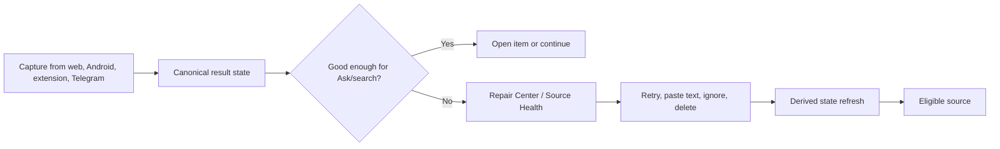

# UX FCP-001 Capture Quality And Repair Center v2

Purpose: Preserve AI Brain Feature Council research and planning evidence.
Audience: Product, design, engineering, documentation maintainers, and AI agents.
Artifact source commit: `9de8de87de915e874e8290aa556e2b6772d6fabf`
Audited application baseline: `2b4db9540d0b76ee6d3aa2a9da5f788b69a8d02a`
Research evidence date: 2026-06-28.
Lifecycle: Latest revision within the 2026-06-28 planning package.
Runtime verification: Not provided.
Superseded by: None.
Public disclosure: Reviewed and sanitized.
Owner: AI Brain maintainer.

> **Historical planning record from 2026-06-28.** This is the latest revision within that planning package. It is not proof of current implementation, deployment, or runtime behavior. Use the living [Feature Catalog](Feature-Catalog) for present status.

Status: v2 final planning package  
Review addressed: [reviews/FCP001_PACKAGE_V1_ADVERSARIAL_REVIEW_2026-06-28_21-23-55_IST.md](Feature-Council-FCP-001-v1-Adversarial-Review)

## UX Direction

The UX should feel like a source health console, not an error dump. Every state gets a short label, plain-language consequence, and one recommended next action.

## Primary Flow

## Key Screens

### Capture Result

- Compact state panel after web capture.
- Android share result page/sheet.
- Extension notification plus popup detail for failure/expired token.

### Repair Center

- Filters: Needs text, Transcript recovery, Failed extraction, Failed summary, Search gaps, Duplicates.
- Row content: title, platform, quality, captured time, current usability, action buttons.
- Bulk action only for safe operations: ignore, delete, retry selected recovery.

### Item Source Health Panel

- Source quality badge.
- Index readiness.
- Repair history.
- Actions relevant to source type.
- "Usable in Ask" yes/no/partial explanation.

## Empty / Loading / Error / Success States

- Empty Review: "No captures need repair."
- Repair running: show queued/running provider-neutral state.
- Provider down: explain the provider and what can still be done.
- Repair failed: show error category and next action, not stack details.
- Success: "Source refreshed" plus what changed.

## Mobile Behavior

- Result page must fit after share handoff without requiring a desktop nav.
- Primary action should be thumb reachable.
- Offline copy must avoid queue language unless offline queue exists.

## Accessibility

- Status icons require text labels.
- Badges must not rely on color alone.
- Repair actions are buttons with visible focus.
- Progress states use `aria-live="polite"` when implemented.

## Prototype

See [prototypes/fcp001-capture-repair-center.html](https://github.com/arunpr614/ai-brain/blob/9de8de87de915e874e8290aa556e2b6772d6fabf/docs/feature-council/prototypes/fcp001-capture-repair-center.html).
