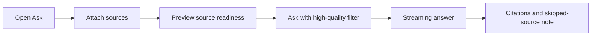
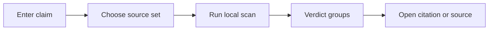

# UX FCP-003 Contextual Ask And Evidence Scan v2

Purpose: Preserve AI Brain Feature Council research and planning evidence.
Audience: Product, design, engineering, documentation maintainers, and AI agents.
Artifact source commit: `9de8de87de915e874e8290aa556e2b6772d6fabf`
Audited application baseline: `2b4db9540d0b76ee6d3aa2a9da5f788b69a8d02a`
Research evidence date: 2026-06-28.
Lifecycle: Latest revision within the 2026-06-28 planning package.
Runtime verification: Not provided.
Superseded by: None.
Public disclosure: Reviewed and sanitized.
Owner: AI Brain maintainer.

> **Historical planning record from 2026-06-28.** This is the latest revision within that planning package. It is not proof of current implementation, deployment, or runtime behavior. Use the living [Feature Catalog](Feature-Catalog) for present status.

Status: v2 final planning package  
Review addressed: [reviews/FCP003_PACKAGE_V1_ADVERSARIAL_REVIEW_2026-06-28_21-23-55_IST.md](Feature-Council-FCP-003-v1-Adversarial-Review)

## UX Direction

Ask should become visibly source-aware. Evidence Scan should feel like a careful local-source audit, not an oracle.

## Ask Flow

## Evidence Scan Flow

## Key Screens

- Ask composer with context chips and source picker.
- Source readiness popover: included, excluded, weak, unindexed.
- Evidence Scan form: claim field, source set, high-quality toggle.
- Evidence result: grouped cards with verdict, cited passage, source, explanation, and action.

## State Taxonomy

| State | User copy direction |
| --- | --- |
| No eligible sources | "None of the selected sources are ready for Ask." |
| Some weak excluded | "3 weak sources were skipped." |
| No matching evidence | "The selected sources did not contain matching evidence." |
| All irrelevant | "Candidates were found, but none addressed the claim." |
| Contradiction | "Some selected sources contradict this claim." |
| Provider down | "AI classification is unavailable; source search may still work." |
| Index stale | "A source changed and needs re-indexing before scan." |

## Mobile Behavior

- Context chips wrap and can open a bottom sheet.
- Source picker is a full-screen sheet on mobile.
- Evidence result groups collapse by default when long.

## Accessibility

- Verdict is text-first, color secondary.
- Citation cards have stable headings.
- Streaming answer and scan progress use polite live regions.

## Prototype

See [prototypes/fcp003-contextual-ask-evidence.html](https://github.com/arunpr614/ai-brain/blob/9de8de87de915e874e8290aa556e2b6772d6fabf/docs/feature-council/prototypes/fcp003-contextual-ask-evidence.html).
