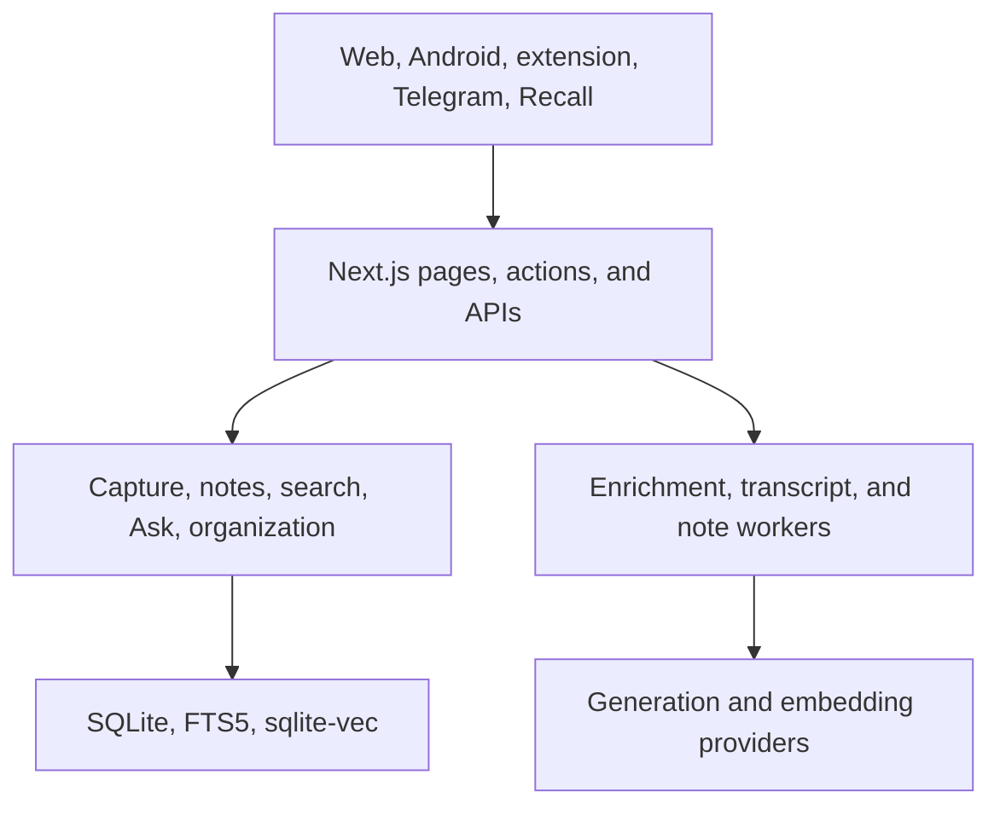

# AI Brain

Purpose: Orient readers to the current product, evidence model, architecture, and documentation paths.
Audience: AI agents, engineers, product/design collaborators, and maintainers.
Verified against: `23868faf13c8e3d0821715e6f5d0e3d2af1e1a34`.
Runtime evidence through: 2026-07-10 at deployed application `6858529ef179a51442d319c6c58e5ace79757619`; runtime evidence remains feature-specific.
Last reviewed: 2026-07-11.
Owner: AI Brain maintainer.

AI Brain is a private, single-owner knowledge system for capturing material, preserving source provenance, enriching it with AI, organizing it, finding it through lexical and semantic retrieval, and asking cited questions across the saved library. Parts of the UI use the alias **AI Memory**.

## Start here

1. Read [AI Agent Start Here](Agent-Onboarding).
2. Confirm [Source Baselines and Status](Source-Baselines-and-Status).
3. Find the capability in the [Feature Catalog](Feature-Catalog).
4. Read its detailed feature page and [Feature Architecture](Feature-Architecture).
5. Check [Command Safety](Command-Safety) before running repository scripts.

## Current product

Current main contains web, Android, browser-extension, Telegram, and guarded Recall entry paths; SQLite persistence; capture provenance and repair; AI enrichment; full-text, semantic, and hybrid retrieval; cited Ask conversations; organization; attached My notes; exports; backups; and owner-oriented operations.

Several capabilities are deliberately not current product behavior. Official caption recovery and owned-media speech-to-text are Inactive. The full Evidence Scan, graph UI, Reading Studio, Trust Center, spaced repetition, Obsidian sync, and fully offline mobile library are Planned; other ideas are separately Explored, Deferred, Rejected or Superseded. See [Ideas and Exploration](Ideas-and-Exploration-Catalog).

The [Card Processing Workflow](Card-Processing-Workflow-Exploration) is a current **Explored — not implemented** proposal with three fictional-data prototype directions. It does not establish a Processing section or workflow/archive lifecycle in the application.

## Architecture at a glance

The standalone Node service, workers, schedules, and one SQLite store form a compact single-owner deployment. See [Architecture Overview](System-Architecture), [Technology Stack](Technology-Stack), and [Data Model](Data-Model).

## Truth rules

- Code and tests prove implementation, not production deployment.
- A migration proves storage support, not a complete user feature.
- Planning and prototypes never prove current behavior.
- Availability, implementation status, confidence, and runtime evidence are separate.
- Unknown is a valid evidence result.
- `docs/wiki/` is canonical; the GitHub Wiki is its published mirror.
