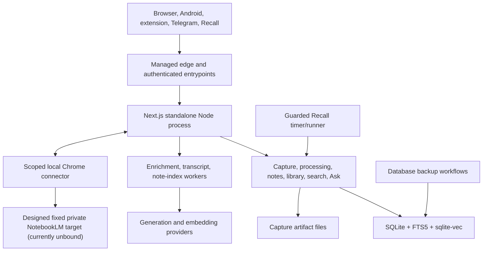

# Architecture Overview

Purpose: Explain AI Brain's components, trust boundaries, data flow, failure isolation, and deployment shape.
Audience: AI agents and engineers making cross-cutting changes.
Verified against: `167a15d57b8f70574a017ea4cda507870f3600d4`.
Runtime evidence through: 2026-07-22 at deployed application `167a15d57b8f70574a017ea4cda507870f3600d4`; NotebookLM is UI-only with no provider canary.
Last reviewed: 2026-07-22.
Owner: AI Brain maintainer.

The Node process handles HTTP, migrations, workers, some schedules, backups, and one SQLite database. This compact design suits one owner but couples failure and resource pressure across capabilities.

## Component responsibilities

- Next.js pages/actions/APIs implement browser UI and client contracts.
- Domain modules enforce capture, card workflow, retrieval, AI, notes, NotebookLM export, integration, and security policy.
- SQLite stores canonical state, FTS, queues, chat, provenance, notes, vectors, and durable NotebookLM connector/target/request control state.
- Capture artifact files retain bounded extraction evidence outside SQLite.
- In-process workers handle enrichment, transcript recovery and note indexing.
- The separate Recall timer invokes a guarded packaged importer.
- Android is a thin WebView/share client; the extension and Telegram call capture contracts. Extension 0.7.0 also contains the experimental scoped NotebookLM connector, but the installed build is not yet loaded or paired.

## Primary flows

Capture validates/authenticates, normalizes/deduplicates, extracts, writes item/provenance/artifacts, initializes new items in Processing Inbox, then queues enrichment and transcript work. Processing reads bounded projections/counts/metrics and commits versioned moves, archive, replay, Undo, and enrollment records without changing content ownership. Enrichment writes generated fields/taxonomy and triggers chunk/embed. Search and Related query FTS/vectors. Ask retrieves eligible chunks, streams citation-constrained output, filters citations and optionally persists chat. Attached notes add independent journal/save/revision/FTS/semantic/consent state. When fully enabled, NotebookLM export freezes one minimized saved-item text snapshot, delivers it through a locally authenticated Chrome session to one pre-bound private notebook, and reconciles an opaque source alias; it is a deliberate static copy, not synchronization.

## Trust boundaries

Browser sessions use PIN-derived session state. Processing routes require that browser session and reject bearer-only access; mutations also require exact origin. API clients share a bearer token for their documented integrations. Pairing exchanges a short-lived one-use code. Telegram requires secret plus owner/private-chat policy. Notes add same-origin and AI consent rules. The NotebookLM connector uses a separate scoped credential and paired extension origin; Google session material remains local to Chrome. Provider/Recall credentials remain private. The managed edge terminates public TLS before the loopback service.

## Failure isolation

Capture save, enrichment, embeddings, transcript recovery, note save/indexing, provider health, Recall imports, NotebookLM request/reconciliation/retention, and backups have separate states. Repair only the failed stage. Never erase valid source or generated state merely because a downstream vector/provider operation failed. NotebookLM provider writes additionally fail closed behind environment and runtime controls.

See [Feature Architecture](Feature-Architecture), [Data Model](Data-Model), [APIs and Integrations](APIs-and-Integrations), and [Known Limitations](Known-Limitations-and-Technical-Debt).
