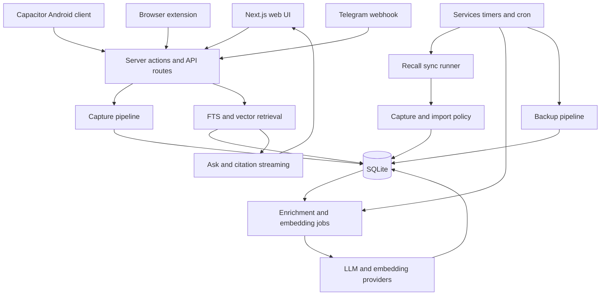

# System Architecture

Purpose: Explain AI Brain's major components, boundaries, and data flow.
Audience: AI agents and engineers making cross-cutting changes.
Verified against: `2b4db9540d0b76ee6d3aa2a9da5f788b69a8d02a` and `8178117c80923e5724e355fb2684cbc836013d39`.
Runtime evidence through: 2026-07-09; complete production tree SHA is Unknown.
Last reviewed: 2026-07-10.
Owner: AI Brain maintainer.

## Component Map

## Web and API Layer

Next.js App Router pages render the Library, Capture, Ask, item, settings, pairing, topic, collection, repair, and diagnostic surfaces. Server actions support authenticated UI mutations. API routes provide capture, Ask streaming, search, exports, pairing, provider status, Telegram, health, threads, and transcript operations.

Pinned entrypoints: [App Router](https://github.com/arunpr614/ai-brain/blob/8178117c80923e5724e355fb2684cbc836013d39/src/app), [application actions](https://github.com/arunpr614/ai-brain/blob/8178117c80923e5724e355fb2684cbc836013d39/src/app/actions.ts), and [auth](https://github.com/arunpr614/ai-brain/blob/8178117c80923e5724e355fb2684cbc836013d39/src/lib/auth.ts).

## Persistence

SQLite is the system of record. Migrations build items, FTS, enrichment queues, chunks, vector indexes, embedding jobs, taxonomy, chat, capture artifacts/cache, transcript records, Telegram update tracking, and Recall synchronization state. `sqlite-vec` backs semantic retrieval.

Database work is synchronous inside server/worker processes. Transactions protect multi-table writes such as chunks plus vector index records. Database-file backups are required before separately authorized production changes.

## Background Work

Enrichment and embedding pipelines convert captured content into summaries, taxonomy, chunks, and vectors. Recall sync has a separate guarded runner with mapping, fidelity checks, locking, checkpoints, reports, and scheduler integration. Services and timers are deployment concerns; exact production commands are private.

## Client Boundaries

The Android app is a Capacitor shell using the hosted web experience plus native share-target behavior. The extension captures pages or selected text through the API. Telegram validates incoming updates and dispatches accepted private-chat content. All remote clients depend on bearer authentication and API compatibility checks.

## Failure Isolation

Capture success, enrichment success, embedding success, and Ask success are separate states. A saved item may remain metadata-only, need repair, fail enrichment, lack vectors, or produce weak retrieval. UI and diagnostics should preserve those distinctions rather than collapsing them into one success flag.
