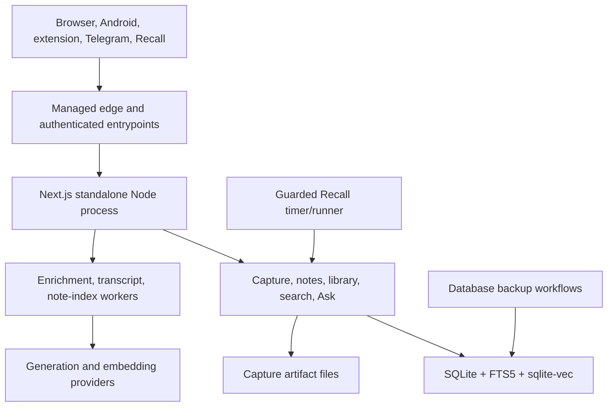

# Architecture Overview

Purpose: Explain AI Brain's components, trust boundaries, data flow, failure isolation, and deployment shape.
Audience: AI agents and engineers making cross-cutting changes.
Verified against: `23868faf13c8e3d0821715e6f5d0e3d2af1e1a34`.
Runtime evidence through: 2026-07-10 at deployed application `6858529ef179a51442d319c6c58e5ace79757619`.
Last reviewed: 2026-07-11.
Owner: AI Brain maintainer.

The Node process handles HTTP, migrations, workers, some schedules, backups, and one SQLite database. This compact design suits one owner but couples failure and resource pressure across capabilities.

## Component responsibilities

- Next.js pages/actions/APIs implement browser UI and client contracts.
- Domain modules enforce capture, retrieval, AI, notes, integration, and security policy.
- SQLite stores canonical state, FTS, queues, chat, provenance, notes and vectors.
- Capture artifact files retain bounded extraction evidence outside SQLite.
- In-process workers handle enrichment, transcript recovery and note indexing.
- The separate Recall timer invokes a guarded packaged importer.
- Android is a thin WebView/share client; the extension and Telegram call capture contracts.

## Primary flows

Capture validates/authenticates, normalizes/deduplicates, extracts, writes item/provenance/artifacts, then queues enrichment and transcript work. Enrichment writes generated fields/taxonomy and triggers chunk/embed. Search and Related query FTS/vectors. Ask retrieves eligible chunks, streams citation-constrained output, filters citations and optionally persists chat. Attached notes add independent journal/save/revision/FTS/semantic/consent state.

## Trust boundaries

Browser sessions use PIN-derived session state. API clients share a bearer token. Pairing exchanges a short-lived one-use code. Telegram requires secret plus owner/private-chat policy. Notes add same-origin and AI consent rules. Provider/Recall credentials remain private. The managed edge terminates public TLS before the loopback service.

## Failure isolation

Capture save, enrichment, embeddings, transcript recovery, note save/indexing, provider health, Recall imports, and backups have separate states. Repair only the failed stage. Never erase valid source or generated state merely because a downstream vector/provider operation failed.

See [Feature Architecture](Feature-Architecture), [Data Model](Data-Model), [APIs and Integrations](APIs-and-Integrations), and [Known Limitations](Known-Limitations-and-Technical-Debt).
