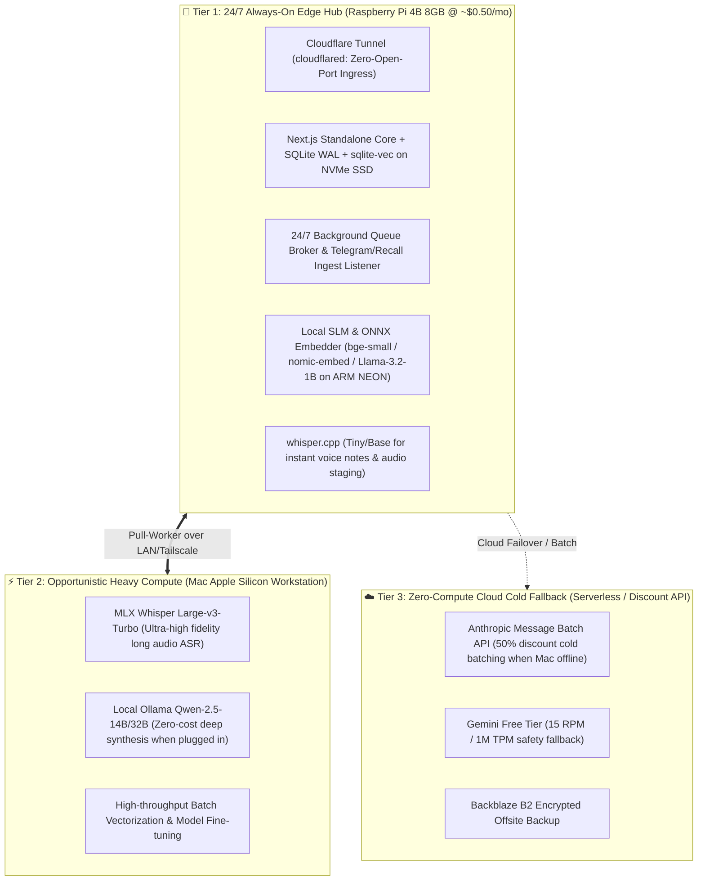

# 📋 Phase 11 Research Backlog: Architecture Efficiency, Cost Reduction & Raspberry Pi 4 Edge Integration (Completed)

**Milestone:** [v0.13.x - Phase 11: Architecture Efficiency, Cost Reduction & Raspberry Pi 4 Edge Research](https://github.com/arunpr614/ai-brain/milestone/15) (Closed / `Done`)  
**GitHub Project View:** [GitHub Project #3 — AI Brain Roadmap](https://github.com/users/arunpr614/projects/3)  
**Epic:** `EPIC-SYSTEM-EFFICIENCY-AND-EDGE-RESEARCH`  
**Target Edge Device:** Raspberry Pi 4 Model B (8 GB RAM)  
**Date:** August 19, 2026  
**Status:** `Completed & Documented`

---

## 🎯 Architecture Vision & Topology

---

## 🎟️ Exploration Spikes Ledger

| Key | Issue | Title | SP | Priority | Status |
| :--- | :--- | :--- | :--- | :--- | :--- |
| `SPIKE-P11-01` | [#139](https://github.com/arunpr614/ai-brain/issues/139) | `SPIKE(phase11-edge): 24/7 Raspberry Pi 4B Edge Node Architecture, Cloudflare Zero Trust Ingress & Hetzner Hosting Cost Reduction` | 5 SP | P1 | `Done` |
| `SPIKE-P11-02` | [#140](https://github.com/arunpr614/ai-brain/issues/140) | `SPIKE(phase11-slm): Ultra-Low-Latency Local Embedding & Small Language Model (SLM) Inference on Raspberry Pi 4B` | 5 SP | P1 | `Done` |
| `SPIKE-P11-03` | [#141](https://github.com/arunpr614/ai-brain/issues/141) | `SPIKE(phase11-hybrid): Hybrid 3-Tier Compute Orchestration & Opportunistic Workstation Offload Architecture` | 5 SP | P1 | `Done` |
| `SPIKE-P11-04` | [#142](https://github.com/arunpr614/ai-brain/issues/142) | `SPIKE(phase11-asr): Edge Audio Staging, Chunking & Lightweight Whisper.cpp Inference on Raspberry Pi 4B` | 3 SP | P2 | `Done` |
| `SPIKE-P11-05` | [#143](https://github.com/arunpr614/ai-brain/issues/143) | `SPIKE(phase11-db): SQLite WAL Tuning, In-Memory Caching & sqlite-vec Vector Retrieval Optimization on RPi 4B` | 5 SP | P1 | `Done` |
| `SPIKE-P11-06` | [#144](https://github.com/arunpr614/ai-brain/issues/144) | `SPIKE(phase11-cost): Comprehensive AI Cost Minimization, Prompt Caching & Multi-Provider Quota Governance` | 3 SP | P2 | `Done` |

---

## 📋 Spike Details & AI Agent Execution Guides

### 1. `SPIKE-P11-01` ([#139](https://github.com/arunpr614/ai-brain/issues/139)): 24/7 Raspberry Pi 4B Edge Node Architecture
- **Objective:** Evaluate hosting Next.js 16 standalone + SQLite + `better-sqlite3` + `sqlite-vec` directly on Raspberry Pi 4B (8GB) with USB 3.0 NVMe SSD storage and Cloudflare Tunnel (`cloudflared`).
- **Target Deliverables:**
  - Resource benchmarks (CPU idle/load, RAM usage, swap behavior on Node 22 ARM64).
  - `cloudflared` tunnel ingress configuration and systemd service unit.
  - Storage IOPS and latency profiling for USB 3.0 UASP NVMe.
  - Zero-downtime database cutover runbook from Hetzner VM to RPi 4B.

### 2. `SPIKE-P11-02` ([#140](https://github.com/arunpr614/ai-brain/issues/140)): Ultra-Low-Latency Local Embeddings & SLMs
- **Objective:** Benchmark quantized embeddings (`bge-small-en-v1.5`, `all-MiniLM-L6-v2`) and 1B–3B SLMs (`Llama-3.2-1B/3B`, `Qwen2.5-1.5B/3B`) running on Cortex-A72 with ARM NEON SIMD.
- **Target Deliverables:**
  - Embedding latency matrix (ms per chunk, vector quality, cosine precision).
  - SLM generation speed (tokens/sec, prompt eval, memory footprint).
  - Prototype TypeScript/C++ ONNX Runtime integration for `src/lib/embed/factory.ts`.

### 3. `SPIKE-P11-03` ([#141](https://github.com/arunpr614/ai-brain/issues/141)): Hybrid 3-Tier Compute Orchestration
- **Objective:** Specify the distributed coordination protocol between the 24/7 RPi 4B edge hub, intermittent Apple Silicon Mac workstation, and cold cloud fallback.
- **Target Deliverables:**
  - Queue leasing, heartbeat, and job timeout state machine diagrams.
  - Tailscale mesh networking configuration and authentication model.
  - Real-time worker presence telemetry badge specification.

### 4. `SPIKE-P11-04` ([#142](https://github.com/arunpr614/ai-brain/issues/142)): Edge Audio Staging & Whisper.cpp
- **Objective:** Evaluate `whisper.cpp` (Tiny.en/Base.en) on RPi 4B for instant draft transcription of voice notes (<2 mins) and 24/7 background staging of YouTube audio streams.
- **Target Deliverables:**
  - RTF (Real-Time Factor) and accuracy benchmarks on ARM Cortex-A72.
  - Local NVMe audio staging and caching protocol.
  - Two-stage draft-to-refined transcript upgrade schema.

### 5. `SPIKE-P11-05` ([#143](https://github.com/arunpr614/ai-brain/issues/143)): SQLite WAL Tuning & sqlite-vec Optimization
- **Objective:** Maximize database throughput, search query speed, and memory safety for `better-sqlite3` + `sqlite-vec` + FTS5 on RPi 4B with 8GB RAM.
- **Target Deliverables:**
  - Optimized SQLite PRAGMA configuration (`mmap_size`, `cache_size`, `WAL`).
  - `sqlite-vec` vector similarity search scaling curve (5k to 50k chunks).
  - Memory-bounding policies for Node.js + SQLite to prevent OOM errors.

### 6. `SPIKE-P11-06` ([#144](https://github.com/arunpr614/ai-brain/issues/144)): Comprehensive AI Cost Minimization
- **Objective:** Model the total operational financial profile across Anthropic Prompt Caching (90% off), Message Batches (50% off), Gemini Free Tier, and local models.
- **Target Deliverables:**
  - Total Cost of Ownership (TCO) financial model spreadsheet.
  - Prompt caching template architecture for `src/lib/enrich/prompts.ts`.
  - Quota governance and budget circuit breaker specification.
