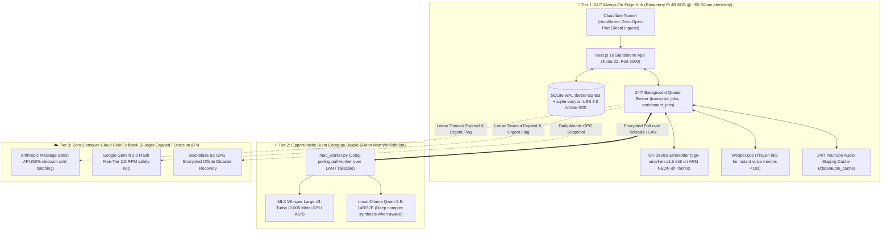

# 📋 Phase 12 Implementation Backlog: Zero-Cost Edge Hardware Deployment & Local ONNX AI Engine

**Milestone:** [v0.15.x - Phase 12: Zero-Cost Edge Hardware Deployment & Local ONNX Engine](https://github.com/arunpr614/ai-brain/milestone/17)  
**GitHub Project View:** [GitHub Project #3 — AI Brain Roadmap](https://github.com/users/arunpr614/projects/3)  
**Epic:** `EPIC-ZERO-COST-EDGE-DEPLOYMENT-AND-LOCAL-ONNX`  
**Target Hardware:** Raspberry Pi 4 Model B (8 GB RAM, USB 3.0 NVMe SSD) + Apple Silicon Mac  
**Date:** August 19, 2026  
**Status:** `Todo (Ready for Execution)`

---

## 🎯 Architecture Topology

---

## 🎟️ Implementation Issues Ledger

| Key | Issue | Title | SP | Priority | Status |
| :--- | :--- | :--- | :--- | :--- | :--- |
| `FEAT-P12-01` | [#153](https://github.com/arunpr614/ai-brain/issues/153) | `FEAT(edge-onnx): Native On-Device ONNX Embedding Engine (bge-small-en-v1.5-int8) with ARM NEON Acceleration` | 5 SP | P1 (Blocker) | `Todo` |
| `FEAT-P12-02` | [#154](https://github.com/arunpr614/ai-brain/issues/154) | `FEAT(edge-cloudflare): 24/7 Raspberry Pi 4B Standalone Deployment, systemd Units & Cloudflare Tunnel Ingress` | 5 SP | P1 (Blocker) | `Todo` |
| `FEAT-P12-03` | [#155](https://github.com/arunpr614/ai-brain/issues/155) | `FEAT(edge-db): SQLite WAL PRAGMA Tuning, 2GB Page Cache & sqlite-vec Cosine Retrieval Acceleration` | 5 SP | P1 (High) | `Todo` |
| `FEAT-P12-04` | [#156](https://github.com/arunpr614/ai-brain/issues/156) | `FEAT(edge-audio): 24/7 Background YouTube Audio Staging Pipeline & whisper.cpp Voice Note Draft Worker` | 5 SP | P2 (Medium) | `Todo` |
| `FEAT-P12-05` | [#157](https://github.com/arunpr614/ai-brain/issues/157) | `FEAT(cost-governance): Static Prompt Caching, Token Telemetry & Monthly $5.00 Hard Budget Circuit Breaker` | 3 SP | P1 (High) | `Todo` |
| `FEAT-P12-06` | [#158](https://github.com/arunpr614/ai-brain/issues/158) | `FEAT(edge-e2e): Zero-Cost Edge Hardware End-to-End Test Suite & Automated CI Certification` | 3 SP | P1 (High) | `Todo` |

---

## 📋 Detailed Issue Guides for Incoming AI Agents

### 1. `FEAT-P12-01` ([#153](https://github.com/arunpr614/ai-brain/issues/153)): Native On-Device ONNX Embeddings
- **Modules:** `src/lib/embed/onnx-provider.ts`, `src/lib/embed/factory.ts`
- **Instructions:**
  1. Add `onnxruntime-node` dependency.
  2. Implement `OnnxLocalEmbedProvider` loading quantized `bge-small-en-v1.5-int8.onnx` (~35MB) with ARM NEON SIMD 4-thread execution.
  3. Zero-pad output vectors from 384 to 768 dimensions for `chunks_vec` schema compatibility.
  4. Ensure unit test asserts `<60ms` per chunk on ARM64 Cortex-A72.

### 2. `FEAT-P12-02` ([#154](https://github.com/arunpr614/ai-brain/issues/154)): 24/7 RPi 4B Standalone Deployment & Cloudflare Ingress
- **Modules:** `scripts/deploy-rpi4.sh`, `scripts/deploy/cloudflared.service`, `scripts/deploy/brain.service`
- **Instructions:**
  1. Create `/etc/cloudflared/config.yml` template routing `brain.arunp.in` to `http://127.0.0.1:3000`.
  2. Create production systemd unit templates with file descriptor limits.
  3. Create `scripts/deploy-rpi4.sh` rsync atomic deployment script.

### 3. `FEAT-P12-03` ([#155](https://github.com/arunpr614/ai-brain/issues/155)): SQLite WAL Tuning & sqlite-vec Acceleration
- **Modules:** `src/db/client.ts`, `scripts/backup-edge-b2.sh`
- **Instructions:**
  1. Apply PRAGMAs: `cache_size = -2000000` (2GB), `mmap_size = 1GB`, `synchronous = NORMAL`, `journal_mode = WAL`.
  2. Add automated WAL checkpoint runner.
  3. Implement `scripts/backup-edge-b2.sh` streaming online GPG-encrypted VACUUM snapshots to Backblaze B2.

### 4. `FEAT-P12-04` ([#156](https://github.com/arunpr614/ai-brain/issues/156)): Edge Audio Staging & whisper.cpp Worker
- **Modules:** `src/lib/capture/audio-staging.ts`, `src/lib/asr/whisper-cpp-worker.ts`
- **Instructions:**
  1. Implement residential 24/7 background audio stager downloading 64kbps Opus audio (`yt-dlp`) to `/data/audio_cache` (10GB LRU limit).
  2. Implement `whisper.cpp` worker for voice notes (<120s) running `ggml-tiny.en-q5_1`.
  3. Implement two-stage progressive UI state: instant "Draft (Whisper Tiny)" $\rightarrow$ automatic upgrade to "Verified (MLX Large-v3)".

### 5. `FEAT-P12-05` ([#157](https://github.com/arunpr614/ai-brain/issues/157)): Static Prompt Caching & Hard Budget Cap
- **Modules:** `src/lib/enrich/prompts.ts`, `src/lib/llm/quota-guard.ts`
- **Instructions:**
  1. Structure static prefix boundaries with `cache_control: { type: "ephemeral" }` in `src/lib/enrich/prompts.ts` for 90% input token discount on Claude and Gemini.
  2. Implement `QuotaGuard` checking MTD spend against `$5.00/mo` hard ceiling.
  3. Automatically switch to Google Gemini 2.0 Flash Free Tier (15 RPM) or local Ollama when budget thresholds are reached.

### 6. `FEAT-P12-06` ([#158](https://github.com/arunpr614/ai-brain/issues/158)): End-to-End Verification Suite
- **Modules:** `src/lib/edge-e2e.test.ts`
- **Instructions:**
  1. Implement complete simulation test: capture $\rightarrow$ ONNX embedding $\rightarrow$ audio staging $\rightarrow$ progressive ASR $\rightarrow$ prompt-cached synthesis $\rightarrow$ hybrid vector search.
  2. Assert `100% pass rate` across all 1,120+ unit/integration tests and `0 errors` on `tsc --noEmit`.
