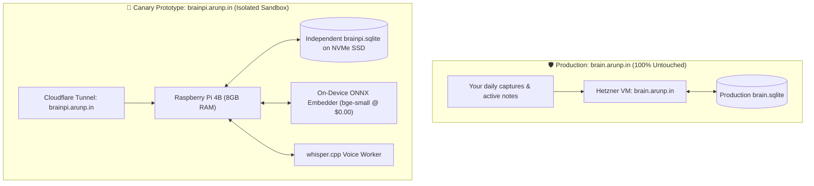

# 📋 Phase 13 Backlog: Canary Edge Prototype (`brainpi.arunp.in`) & Safe Rollout Harness

**Milestone:** [v0.16.x - Phase 13: Canary Edge Prototype (brainpi.arunp.in) & Safe Rollout Harness](https://github.com/arunpr614/ai-brain/milestone/18)  
**GitHub Project View:** [GitHub Project #3 — AI Brain Roadmap](https://github.com/users/arunpr614/projects/3)  
**Epic:** `EPIC-CANARY-EDGE-PROTOTYPE-AND-SAFE-ROLLOUT`  
**Target Hardware:** Raspberry Pi 4 Model B (8 GB RAM) on `https://brainpi.arunp.in`  
**Date:** August 19, 2026  
**Status:** `Todo (Planning / Specification Only — No Implementation Started)`

---

## 🎯 Architecture Topology

---

## 🎟️ Implementation Issues Ledger

| Key | Issue | Title | SP | Priority | Status |
| :--- | :--- | :--- | :--- | :--- | :--- |
| `FEAT-P13-01` | [#159](https://github.com/arunpr614/ai-brain/issues/159) | `FEAT(canary-infra): Independent Canary Raspberry Pi 4B Deployment & Cloudflare Tunnel (brainpi.arunp.in)` | 5 SP | P1 (Blocker) | `Todo` |
| `FEAT-P13-02` | [#160](https://github.com/arunpr614/ai-brain/issues/160) | `FEAT(canary-sandbox): Automated Seeded Sandbox Exporter & Sanitized Dataset Ingestion Tool` | 3 SP | P1 (High) | `Todo` |
| `FEAT-P13-03` | [#161](https://github.com/arunpr614/ai-brain/issues/161) | `FEAT(canary-compare): Side-by-Side Dual-Engine Benchmark & Evaluation Harness (/debug/compare)` | 5 SP | P1 (High) | `Todo` |
| `FEAT-P13-04` | [#162](https://github.com/arunpr614/ai-brain/issues/162) | `FEAT(canary-client): Multi-Environment Client Switcher for Chrome Extension & Web Companion` | 3 SP | P2 (Medium) | `Todo` |
| `FEAT-P13-05` | [#163](https://github.com/arunpr614/ai-brain/issues/163) | `FEAT(canary-telemetry): 7-Day Burn-In Hardware Health Monitor & Stability Telemetry Logger` | 3 SP | P2 (Medium) | `Todo` |
| `FEAT-P13-06` | [#164](https://github.com/arunpr614/ai-brain/issues/164) | `FEAT(canary-promotion): Automated Zero-Downtime Production Cutover & Disaster Recovery Runbook` | 3 SP | P1 (High) | `Todo` |

---

## 📋 Detailed Issue Guides for Incoming AI Agents

### 1. `FEAT-P13-01` ([#159](https://github.com/arunpr614/ai-brain/issues/159)): Canary Deployment & Cloudflare Tunnel
- **Modules:** `scripts/deploy-canary-pi.sh`, `scripts/deploy/cloudflared-canary.yml`, `scripts/deploy/brain-canary.service`
- **Scope:** Complete isolated setup on `brainpi.arunp.in` pointing to independent data root `/opt/brainpi/` with zero shared state with production.

### 2. `FEAT-P13-02` ([#160](https://github.com/arunpr614/ai-brain/issues/160)): Seeded Sandbox Exporter & Importer
- **Modules:** `scripts/export-canary-seed.ts`, `scripts/import-canary-seed.ts`
- **Scope:** Export sanitized 100-item snapshot from production, strip auth secrets, and import into `brainpi.sqlite` for instant day-1 search and Reading Studio testing.

### 3. `FEAT-P13-03` ([#161](https://github.com/arunpr614/ai-brain/issues/161)): Side-by-Side Dual-Engine Compare Harness
- **Modules:** `src/app/debug/compare/page.tsx`, `scripts/bench-compare-engines.ts`
- **Scope:** Concurrent query execution against production (`brain.arunp.in`) vs canary (`brainpi.arunp.in`) displaying embedding latency, search score overlap, and cost comparison.

### 4. `FEAT-P13-04` ([#162](https://github.com/arunpr614/ai-brain/issues/162)): Multi-Environment Client Switcher
- **Modules:** `extension/src/options.tsx`, `extension/src/popup.tsx`
- **Scope:** Profile toggle in Chrome extension allowing 1-click capture target switching between `🟢 Production` and `🧪 Canary Lab`.

### 5. `FEAT-P13-05` ([#163](https://github.com/arunpr614/ai-brain/issues/163)): 7-Day Burn-In Health Monitor
- **Modules:** `scripts/monitor-pi-health.sh`, `src/app/api/health/canary/route.ts`
- **Scope:** Telemetry logger certifying CPU temp `<55°C`, RAM RSS `<2.5GB`, and 0 crashes over 7 sustained days.

### 6. `FEAT-P13-06` ([#164](https://github.com/arunpr614/ai-brain/issues/164)): Production Promotion & Rollback Runbook
- **Modules:** `scripts/promote-canary-to-prod.sh`, `docs/runbooks/CANARY_PROMOTION_AND_DISASTER_RECOVERY.md`
- **Scope:** Final delta sync, Cloudflare DNS CNAME update (<2s cutover), and instant 1-command rollback script.
