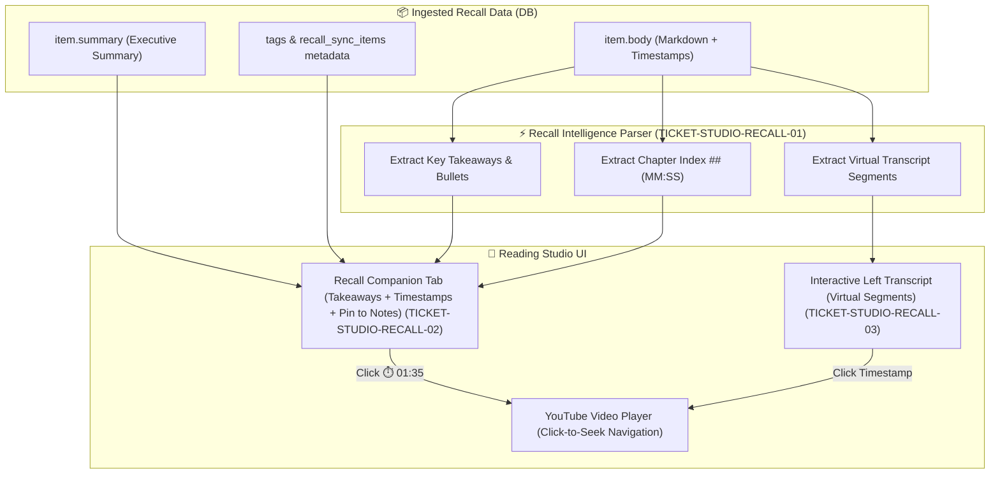

# 📋 Phase 3 Execution Backlog: Rich Recall Memory Intelligence & Virtual Transcript Sync
**Milestone:** [v0.9.1 - Reading Studio: Rich Recall Memory Intelligence & Virtual Transcript Sync](https://github.com/arunpr614/ai-brain/milestone/14)  
**GitHub Project View:** [Phase 3 - Reading Studio and Triage Board](https://github.com/users/arunpr614/projects/3/views/6)

---

## 🎯 Architecture Summary

---

## 🎟️ Issue Specifications

### 1. Issue #133: `FEAT(phase3-studio): Recall Memory & Timestamp Parser Engine`
- **Key:** `TICKET-STUDIO-RECALL-01`
- **Link:** [#133](https://github.com/arunpr614/ai-brain/issues/133)
- **Module:** `src/lib/reading-studio/recall-parser.ts`
- **Scope:**
  - TypeScript parser for Recall memory markdown in `items.body`.
  - Regular expressions for `(HH:MM:SS)` and `(MM:SS)` timestamps.
  - Section extraction for `## Heading (MM:SS)` and bullet takeaways `- `.
  - Virtual segment generation for speech dialogue chunks.
  - 100% resilient handling across all 169 existing Recall items in the database.

---

### 2. Issue #134: `FEAT(phase3-studio): Rich Recall Companion Layer UI with Interactive Timestamps & Pin to Notes`
- **Key:** `TICKET-STUDIO-RECALL-02`
- **Link:** [#134](https://github.com/arunpr614/ai-brain/issues/134)
- **Module:** `src/components/reading-studio/multi-layer-companion-tabs.tsx`
- **Scope:**
  - Re-engineer Tab 4 (`Recall`) into a rich multi-section Recall Intelligence Deck.
  - Interactive clickable timestamp pills `⏱️ MM:SS` that call `onSeek(timestampMs)` on the YouTube player.
  - One-click `📌 Pin to Notes` action button on each takeaway, dispatching events to the active user notes editor.
  - Interactive chapter navigation table of contents.
  - Sync metadata provenance header card (Card ID, Sync fidelity, tags).

---

### 3. Issue #135: `FEAT(phase3-studio): Virtual Interactive Transcript Fallback for Recall Items`
- **Key:** `TICKET-STUDIO-RECALL-03`
- **Link:** [#135](https://github.com/arunpr614/ai-brain/issues/135)
- **Module:** `src/components/reading-studio/reading-studio-app.tsx` & `src/components/reading-studio/transcript-timeline.tsx`
- **Scope:**
  - Automatically fallback to `RecallVirtualSegment[]` when `segments.length === 0` for Recall imports.
  - Full real-time search, filtering, and active playback highlighting.
  - Informational badge: `Displaying imported Recall transcript. Apple MLX Whisper refinement pending.`
  - Seamless upgrade when ASR jobs finish.

---

### 4. Issue #136: `FEAT(phase3-studio): Automated Verification Suite, Bidirectional Seeking Tests & Integration Certification`
- **Key:** `TICKET-STUDIO-RECALL-04`
- **Link:** [#136](https://github.com/arunpr614/ai-brain/issues/136)
- **Module:** `src/lib/reading-studio/recall-parser.test.ts`
- **Scope:**
  - Comprehensive unit test suite covering standard, multiline, edge-case Recall bodies, and non-Recall items.
  - Timestamp math verification and seeking integration tests.
  - `npm test` and `npm run typecheck` passing with zero regressions.
